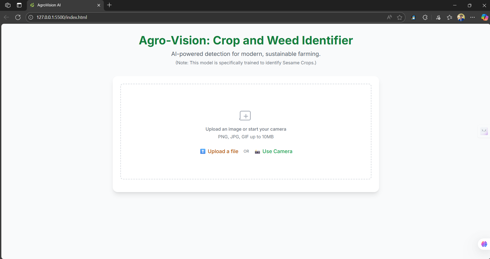
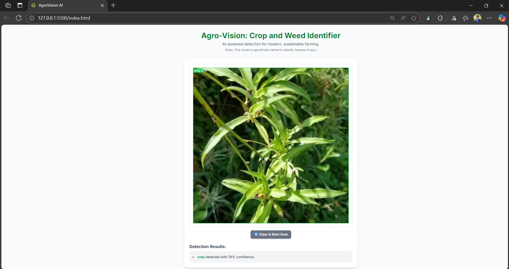
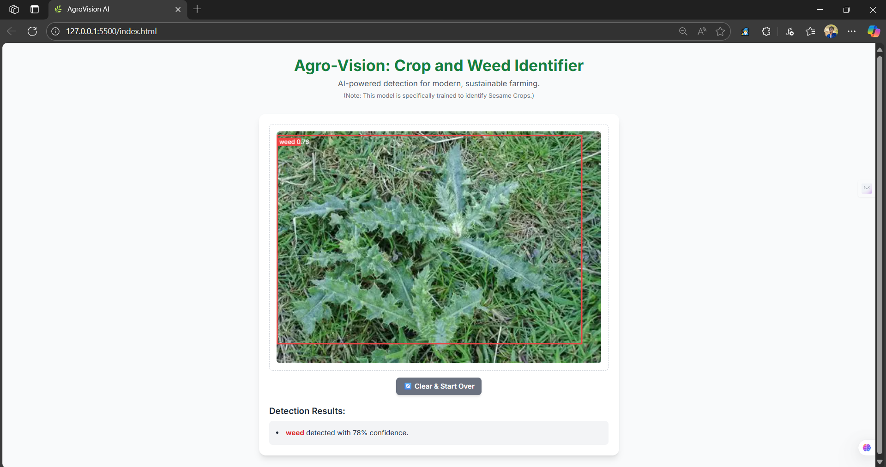

# Agro-Vision: Crop & Weed Identifier 🌱🤖

## Overview
Agri-Vision is an AI-powered web application designed to identify crops and weeds in real time using YOLO-based object detection.  
The project integrates a Flask backend for model inference with a modern HTML/CSS/JS frontend for interactive visualization.

---

## Features
- 🌿 Real-time crop vs. weed detection
- 📷 Upload images or use live webcam feed
- ⚡ Fast inference with YOLOv8
- 🎨 Clean and responsive UI
- 🔗 Flask REST API for model serving

---

## Tech Stack
- **Backend**: Python, Flask, PyTorch, Ultralytics YOLOv8
- **Frontend**: HTML, CSS, JavaScript
- **Others**: OpenCV, NumPy

---

## Project Structure
```
├── app.py                # Flask backend
├── static/               # CSS, JS, and images
│   ├── script.js
│   ├── style.css
│   └── images/
├── templates/
│   └── index.html        # Frontend UI
├── models/
│   └── crop_weed_detector_v1.pt   # YOLO trained model
├── requirements.txt      # Dependencies
└── README.md             # Documentation
```

---

## Installation & Setup

### 1. Clone the repository
```bash
git clone https://github.com/your-username/agri-vision.git
cd agri-vision
```

### 2. Create and activate virtual environment
```bash
python -m venv venv
venv\Scripts\activate    # On Windows
source venv/bin/activate   # On Linux/Mac
```

### 3. Install dependencies
```bash
pip install -r requirements.txt
```

### 4. Place trained model
Download or move your trained YOLO model into the `models/` folder and rename it to:
```
crop_weed_detector_v1.pt
```

### 5. Run the Flask app
```bash
python app.py
```

By default, it runs on `http://127.0.0.1:7860/`.

---

## Frontend ↔ Backend Connection
In `static/script.js`, update the backend API URL if needed:

```javascript
const response = await fetch('http://127.0.0.1:7860/predict',{
    method: 'POST',
    body: formData,
});
```

- If backend is on localhost → keep `127.0.0.1:7860`
- If backend is on LAN (e.g., `10.165.57.141`) → change it to:
  ```js
  'http://10.165.57.141:7860/predict'
  ```

---

## Demo Screenshots

![Screenshot 1]
![Screenshot 2]
![Screenshot 3]

---

## Future Improvements
- 🚜 Support for multiple crop types
- 🌎 Deployment on Render / AWS / GCP
- 📊 Analytics dashboard for farmers
- 🔊 Voice-based feedback system

---

## License
This project is licensed under the MIT License.
